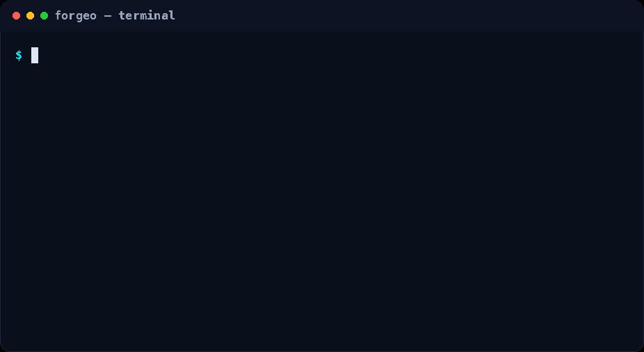

<div align="center">
  
</div>

<div align="center">
  
</div>


[](https://github.com/lucaGazzola/forgeo/actions/workflows/ci.yml)
[](https://opensource.org/licenses/MIT)

<div align="center">
  
</div>

**Forgeo is a software factory for your coding-agent.**
You're already working with an AI coding agent, prompting it task by task
or giving it a goal. Forgeo organizes your work in a structured way with
a backlog, and it decides what to work on next, runs your
agent on it, and commits the result. Progress, pending decisions, and history
are tracked in plain files you can inspect at any time, plus a web dashboard.
Forgeo only interrupts you when a decision is genuinely yours to
make, everything else happens autonomously. Transient failures (a network
blip, a flaky test) are retried automatically when the retry policy is
enabled, and only a task that keeps failing or genuinely needs a human
decision ever reaches you.

All you need is basic comfort with a terminal, a git repository, and any coding
agent CLI.

## Quickstart

The full walkthrough is in [Getting started](docs/getting-started.md).

### 1. Install the CLI

Pick any one installer (no root needed; re-running it upgrades Forgeo).

```bash
# Homebrew (macOS / Linux): prebuilt binary, no Python required
brew install lucaGazzola/forgeo/forgeo

# One-liner (Linux / macOS / Windows): prebuilt binary, falls back to pip
curl -fsSL https://forgeo.org/install.sh | bash

# pip (Python 3.11+)
pipx install forgeo-cli
```

### 2. Create your Forgeo

```bash
forgeo init
```

Guided wizard, run from your project root. Writes `forgeo.yaml` (the
config) and a `.forgeo/` folder for the backlog, logs and blocker files.

The base flow is then three steps: fill the backlog, check the
configuration, start the daemon.

### 3. Fill the backlog

```bash
# Either: edit the backlog file by hand — a plain JSON task list (see
# Backlog format), created on first use:
#   .forgeo/backlog.json

# Or: configure `backlog_provider: jira` and set `backlog` to a Jira base URL
# (see the Jira backlog documentation).

# Or: add tasks from the web console once your forgeo is registered
# (first `forgeo start` registers it automatically):
forgeo web      # dashboard at http://0.0.0.0:8790, or keep it on with `forgeo web -d`
```


### 4. Check the configuration

```bash
forgeo validate
```

Read-only dry run before the first start: verifies `forgeo.yaml`, the git
repo, branch and remote, that the backlog parses (fetching it once when it
is an HTTP endpoint), the agent command, and the lock state. Never invokes
the agent and writes nothing.

### 5. Start the daemon

```bash
forgeo start
```

Starts the daemon **detached in the background** and exits. Every
`interval_minutes` it runs one cycle: pick the oldest `OPEN` task whose
dependencies are all `COMPLETED`, run your coding agent on it, commit the
result. When the backlog is empty, the same agent runs a refactoring pass
over the codebase instead.

### Day-to-day commands

```bash
forgeo status    # Config, backlog counts, next runnable task, daemon running?, last outcome
forgeo once      # Run exactly one cycle in the foreground, no daemon left behind
forgeo run --task SELF-012  # Run one specific OPEN task now (triage)
forgeo stop      # Stop the background daemon
forgeo restart   # Stop and start again (re-reads forgeo.yaml after edits)
forgeo web       # Dashboard: every instance's backlog, run history and logs
```

`forgeo web` defaults to an open dashboard on `http://0.0.0.0:8790`; on a
shared host protect it with `forgeo web --token` (requires
`Authorization: Bearer <token>` on every `/api/*` route — see
[Web console & HTTP API](docs/web-console-api.md)).

### Running the agent in a container

By default Forgeo runs the agent directly on the host. To run it inside a
Docker container instead, set `agent_sandbox: docker` in `forgeo.yaml`:

```yaml
agent_sandbox: docker
agent_sandbox_image: your-image
agent_sandbox_network: none   # default; set bridge/host to allow network
agent_sandbox_mounts:         # optional, read-only, e.g. ~/.claude
  - ~/.claude
```

The image must already contain the agent CLI your `agent_command` uses plus a
shell (nothing is installed at run time). Forgeo bind-mounts the repository
into the container at the same path, so the agent's edits land on your
checkout and are committed as usual; the task is passed through as
`FORGEO_TASK`. Networking is off by default (`none`) and nothing else is
visible inside the container unless you list it in `agent_sandbox_mounts`.
See the [Configuration](docs/configuration.md) docs for details.

### Multiple repositories (instances)

Run several factories at once, one per repository; each config is fully
independent (own backlog, logs, locks). Register each `forgeo.yaml` with
`forgeo instance add NAME --config PATH`, manage any of them by name with
`forgeo start/status/stop --name NAME`, list them all with `forgeo list`,
and get one aggregate overview with the central dashboard, `forgeo web`.

## Documentation

| Topic | Where |
| --- | --- |
| Install, init, first cycle | [Getting started](docs/getting-started.md) |
| Every `forgeo.yaml` key | [Configuration](docs/configuration.md) |
| Task schema and statuses | [Backlog format](docs/backlog.md) |
| How the agent is invoked (env, exit codes, timeouts) | [Agent contract](docs/agent-contract.md) |
| All CLI commands | [CLI reference](docs/cli-reference.md) |
| Web dashboard & HTTP API | [Web console & HTTP API](docs/web-console-api.md) |

Everything is stored in plain files: the local backlog, `forgeo.log`, and
`BLOCKER.md` whenever a decision is pending. The backlog can also live in
another application behind an `http(s)` URL, or in Jira. HTTP backlogs
exchange the complete task document; Jira issues are read and transitioned
individually with workflow state and engine metadata stored on the issue (see
[Backlog format](docs/backlog.md)). A *file* backlog is snapshotted (rotating
`backlog.json.bak` files) before every agent run and on daemon startup, and
restored automatically if it is ever found corrupt — a bad write never loses
your tasks.

## Develop

```bash
pip install -e ".[dev]"
pytest
```

See [CONTRIBUTING.md](CONTRIBUTING.md) for the development setup, quality
gates (`pytest`, `ruff check`, `mypy src/forgeo`), and the pull-request
process.

## License

MIT — see [LICENSE](LICENSE).
